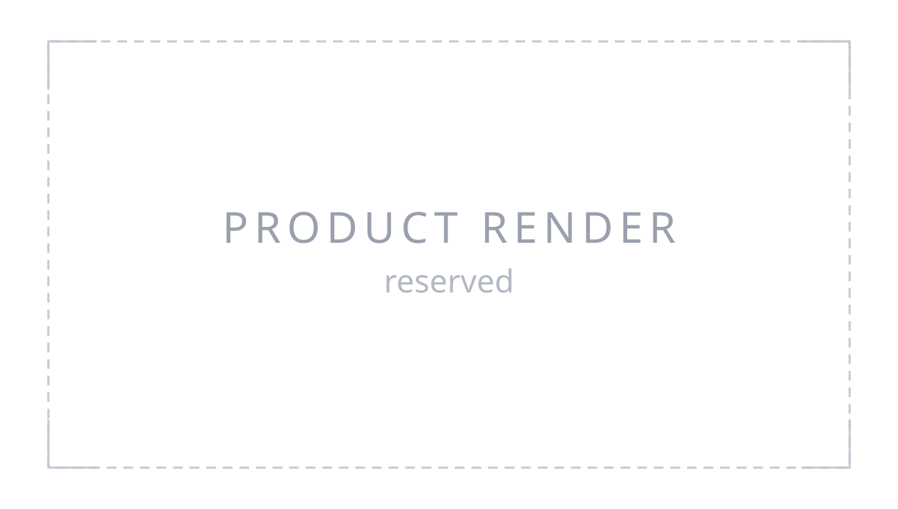

Serval Robotics

# QBot Mini

Open quadruped development platform. Twelve joints, a closed five-bar leg, ROS 2
on top, and a MuJoCo simulation that runs the same control stack as the
hardware.

You command the body — a velocity, a turn rate, a
posture — and the robot works out the joints. Everything runs on the machine:
no cloud service, no network dependency.

  

  

    Mass
    2.0 kg
    Measured
  

  

    Joints
    12
    Three per leg
  

  

    Trot speed
    0.22 m/s
    Simulated
  

  

    Payload
    —
    Not yet characterized
  

Every figure in this documentation states how it was obtained, so you can tell
which numbers are safe to design against. Where nobody has taken a measurement
yet, it says so — see [Specifications](reference/specifications.md).

## What it does

- Walks and trots under velocity command, in simulation and on hardware
- Holds a commanded posture and body height independently of the gait
- Runs scripted routes, and records what happened for analysis
- Exposes everything over ROS 2, with no cloud service and no network dependency
- Simulates identically: the same controller drives the model and the machine

## What it does not do

Stating this plainly is what makes the rest of the documentation worth trusting.

- **Not a certified product.** No safety rating, no protective stop conforming to
  a machinery standard. Laboratory equipment. See [Safety](safety.md).
- **Not autonomous.** There is no navigation stack, no mapping and no obstacle
  avoidance in the shipped software. It goes where it is told.
- **Not open source.** The gait generator and the impedance controller are
  proprietary. The interface to them is fully specified; their internals are not.
- **Not characterized on every axis.** Payload, runtime and gradeability have not
  been measured. Where a figure is unknown, the
  [specifications](reference/specifications.md) say so rather than estimating.

## How to read this

-   **See it move**

    No hardware needed. From nothing to a trotting robot on your own machine.

    [Quick start: simulation](getting-started/simulation.md)

-   **Drive a real one**

    Read the safety page first. Then unboxing to first stand.

    [Safety](safety.md) · [Quick start: hardware](getting-started/hardware.md)

-   **Write software for it**

    One topic drives the robot. The same interface in simulation and on
    hardware.

    [Control architecture](programming/control-architecture.md)

-   **Check whether it fits**

    What is measured, what is simulated, and what is not characterized yet.

    [Specifications](reference/specifications.md)

---

**Document version 0.0.** This documentation is being written. Pages arrive as
they are verified against the robot rather than as they are drafted, so what is
here is accurate and what is missing is marked. If you are evaluating the
platform and need something that is not here yet, ask — much of it exists and
has simply not been written up.
