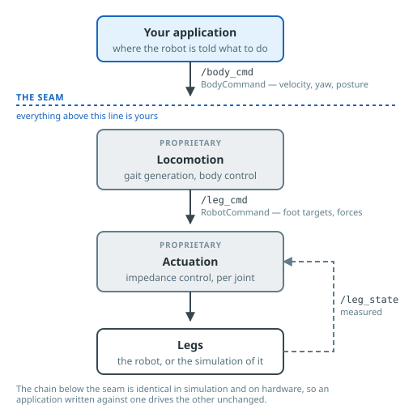

# Control architecture

Everything that drives the robot goes through a single ROS 2 topic. Your
application says *where the body should go*; the robot works out what the twelve
joints do about it.

## The seam

`/body_cmd` is the boundary between your code and ours. Above it you write
intent — a velocity, a turn rate, a posture. Below it are the gait generator and
the impedance controller, which are **proprietary** and not documented beyond
their behaviour.

That is the whole contract. You do not need to know how the gait is generated to
use the robot, and you cannot break it by getting the internals wrong, because
you never touch them.

## Simulation and hardware share the chain

The blocks below the seam are the same code in both cases. The only thing that
changes is what sits at the bottom: a MuJoCo model, or twelve real servos.

This is why an application developed against the simulator drives the real robot
unchanged, and why a gait that fails in simulation fails on hardware for the same
reason. The simulation is not an approximation of a separate control system — it
is the same control system with a different set of legs attached.

## What runs where

| Layer | Runs on | You can |
| :- | :- | :- |
| Your application | Anywhere on the ROS 2 network | Write it, replace it, run several |
| Locomotion | The robot's onboard computer | Configure through [parameters](parameters.md) |
| Actuation | The robot's onboard computer, or the joint controllers | Configure through parameters |
| Legs | The robot | — |

Control and motion run entirely on the robot. Nothing in the chain needs a
network connection, a cloud service, or a GPU. If your application disconnects,
the robot [stands up and waits](ros2-interface.md#the-deadman) rather than
carrying on.

## Going below the seam

If your work needs to replace the locomotion layer — a research controller, a
modified linkage, direct joint control — that is possible and it is a
conversation we are happy to have. It is not something the published interface
supports on its own.
