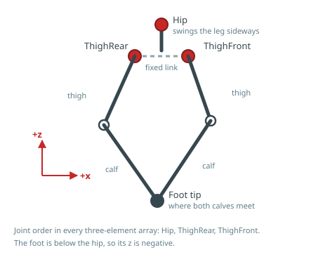

# Leg geometry

Each leg carries three joints and a closed five-bar linkage. Knowing its shape
matters for two things: reasoning about where a foot can go, and understanding
why the joint names are what they are.

## Three joints, two of them driving a loop

| Joint | Does |
| :- | :- |
| `Hip` | Swings the whole leg sideways, about the body's `x` axis |
| `ThighRear` | Drives the rear half of the linkage |
| `ThighFront` | Drives the front half of the linkage |

`ThighRear` and `ThighFront` do not correspond to a hip and a knee. They are the
two driven corners of a five-bar loop, and the foot tip is where the two calf
links meet. Moving either one moves the foot in both `x` and `z`.

## Why a closed linkage

Both motors sit at the top of the leg rather than one being carried out at the
knee. The leg's own mass stays close to the body, which matters more at this
scale than it does on a large robot: less inertia to swing means less torque
spent moving the leg rather than the machine.

The cost is that the joint-to-foot relationship is not the textbook serial-chain
one. You do not have to deal with that — commanded motion is specified as a
**foot position**, and the conversion happens below the
[seam](../programming/control-architecture.md#the-seam).

## Foot positions

Foot positions are expressed in the leg frame, in metres, using the same axis
directions as the [body frame](conventions.md#body-frame). The foot is below the
hip, so `z` is negative.

!!! warning "No per-leg mirroring"

    The same convention applies to all four legs. Do not negate `y` for the
    right-hand legs — mounting orientation is accounted for on the motor
    controller, not in the command.

!!! note "Being written"

    The reachable foot workspace has not been published yet: its boundary
    depends on link lengths and joint ranges, and those figures are
    [not yet characterized](specifications.md).
